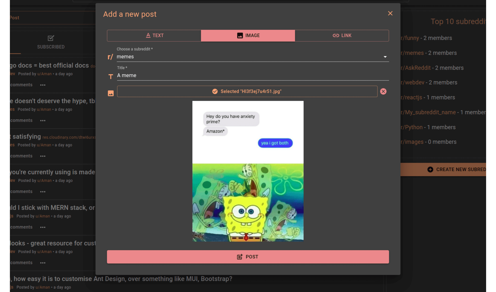

# Reddish - A Reddit Clone - MERN ( Developed by Akash Vinod Bhambere )

[Reddit](https://www.reddit.com) clone (a social media site) made w/ MERN stack & Redux.

#### Front-end

- [ReactJS](https://reactjs.org/) - Frontend framework
- [Redux w/ useDispatch & useSelector hooks](https://redux.js.org/) - For state management
- [Redux Thunk](https://github.com/reduxjs/redux-thunk) - For asynchronous actions
- [React Router](https://reactrouter.com/) - For general routing & navigation
- [Formik](https://formik.org/) - For flexible forms
- [Material-UI w/ lots of CSS customisations](https://material-ui.com/) - UI library
- [Yup](https://github.com/jquense/yup) - For form validation

#### Back-end

- [Node.js](https://nodejs.org/en/) - Runtime environment for JS
- [Express.js](https://expressjs.com/) - Node.js framework, makes process of building APIs easier & faster
- [MongoDB](https://www.mongodb.com/) - Database to store document-based data
- [Mongoose](https://mongoosejs.com/) - MongoDB object modeling for Node.js
- [Cloudinary](https://cloudinary.com/) - For image uploading & related API
- [JSON Web Token](https://jwt.io/) - A standard to secure/authenticate HTTP requests
- [Bcrypt.js](https://www.npmjs.com/package/bcryptjs) - For hashing passwords
- [Validator.js](https://www.npmjs.com/package/validator) - For validation of JSON data
- [Mongoose Unique Validator](https://www.npmjs.com/package/mongoose-unique-validator) - Plugin for better error handling of unique fields within Mongoose schema
- [Dotenv](https://www.npmjs.com/package/dotenv) - To load environment variables from a .env file

## Features

- Authentication (login/register with username-password)
- CRUD posts & comments
- Add posts in the form of text, link or image
- Upvote/downvote posts & comments
- Dynamic URLs for users (u/Aman) & subreddits (r/reactjs)
- Sorting of posts on basis of algorithms like hot, top, controversial etc.
- Full database search feature
- Pagination of posts
- Error management to prevent app crashes
- Sort comments by oldest, newest, most upvoted etc.
- Avatar uploading for user profiles
- Toast notifications for actions: adding posts, deleting comments etc.
- Loading spinners for relevant fetching processes
- Dark mode toggle w/ local storage save
- Responsive UI for all screens

## Screenshots
[](https://github.com/imcoder16/Reddish-A-Reddit-Clone/blob/7aad195612c10a305a6b297065004534f885b396/Add%20Post.png)

## Usage

Notes:

- For image API, make account at cloudinary.com & get API keys from account dashboard.
- For upload preset usage, if you want to organize images separately at cloudinary.com, you have to create it from account settings first. If you don't want to, just don't put anything or use .env key - `UPLOAD_PRESET`.

#### Env variable:

Create .env file in server directory and add the following:

```
MONGODB_URI = "Your Mongo URI"
PORT = 3005
SECRET = "Your JWT secret"
CLOUDINARY_NAME = "From your cloudinary dashboard"
CLOUDINARY_API_KEY = "From your cloudinary dashboard"
CLOUDINARY_API_SECRET = "From your cloudinary dashboard"
UPLOAD_PRESET = "Folder/preset name from your cloudinary account" (OPTIONAL)
```

#### Client:

Open client/src/backendUrl.js & change "backend" variable to `"http://localhost:3005"`

```
cd client
npm install
npm start
```

#### Server:

Note: Make sure that you have installed 'nodemon' as global package.

```
cd server
npm install
npm run dev
```
